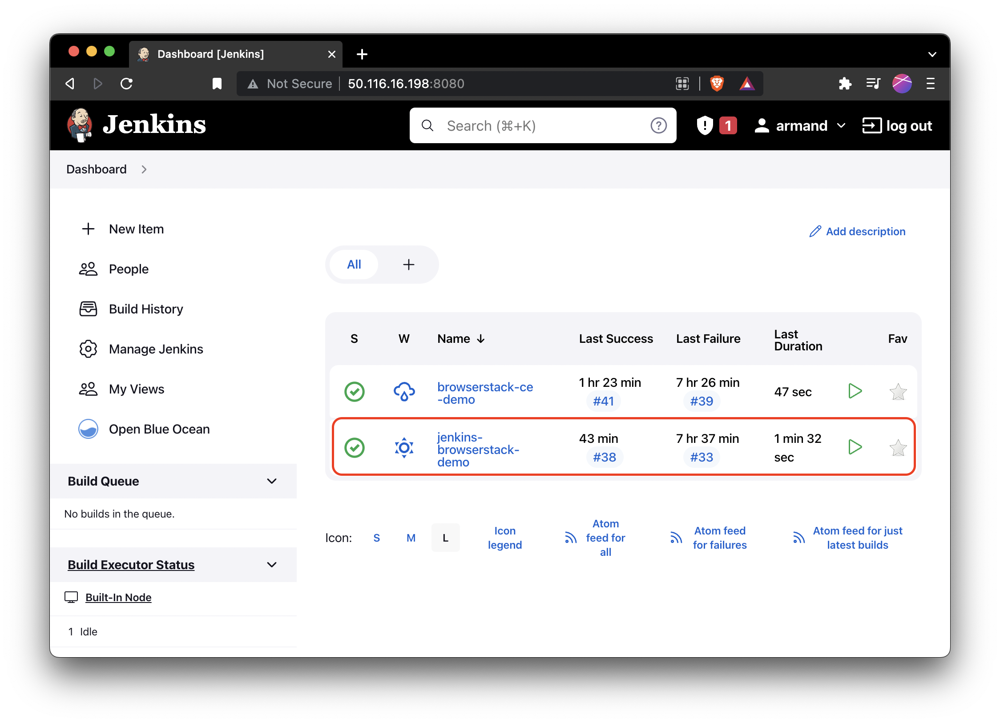
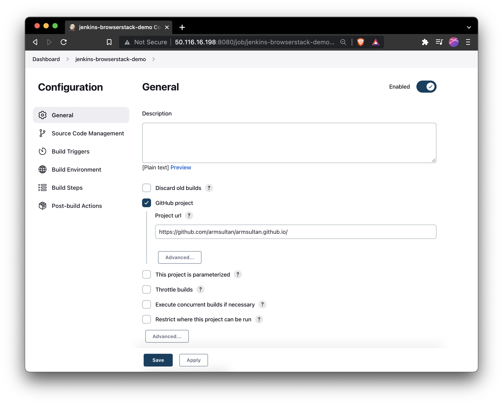
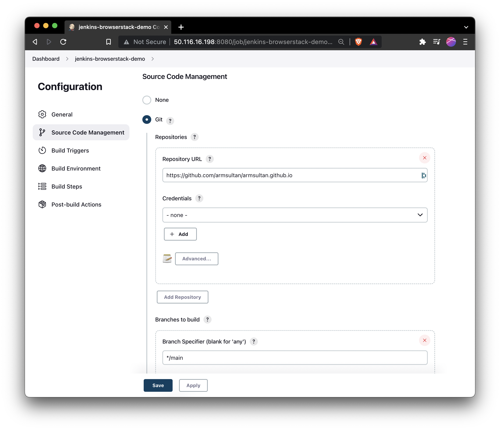
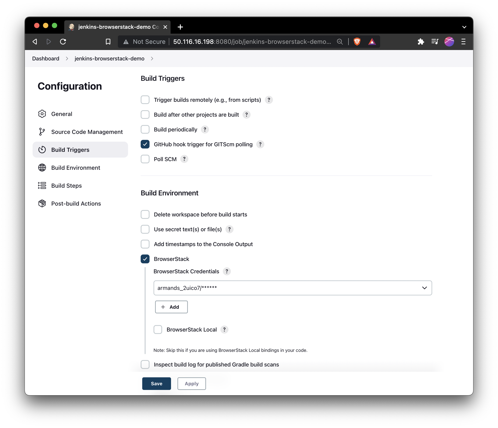
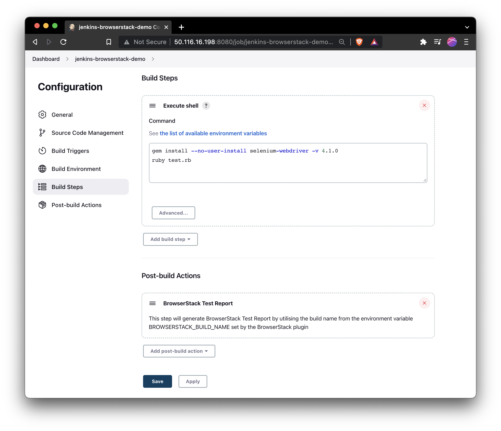
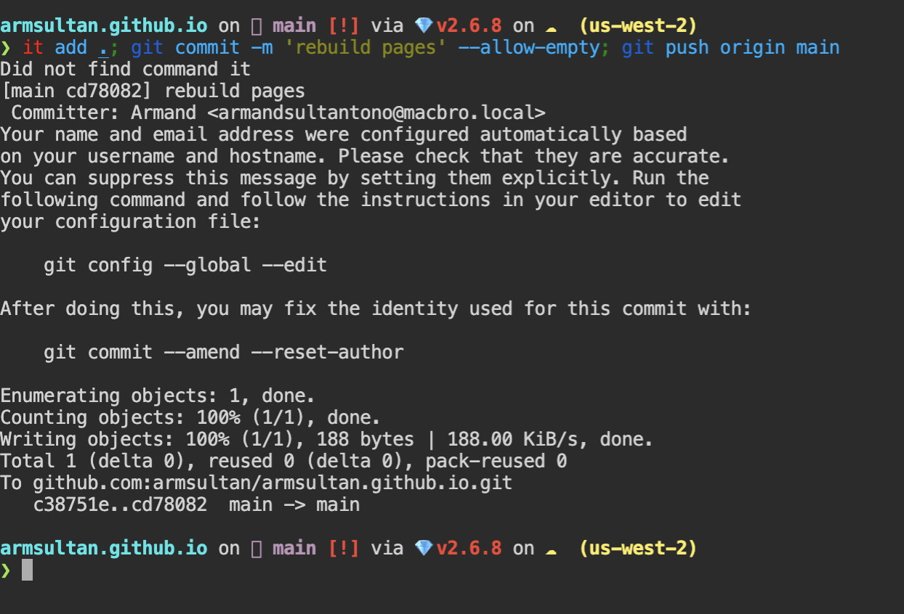
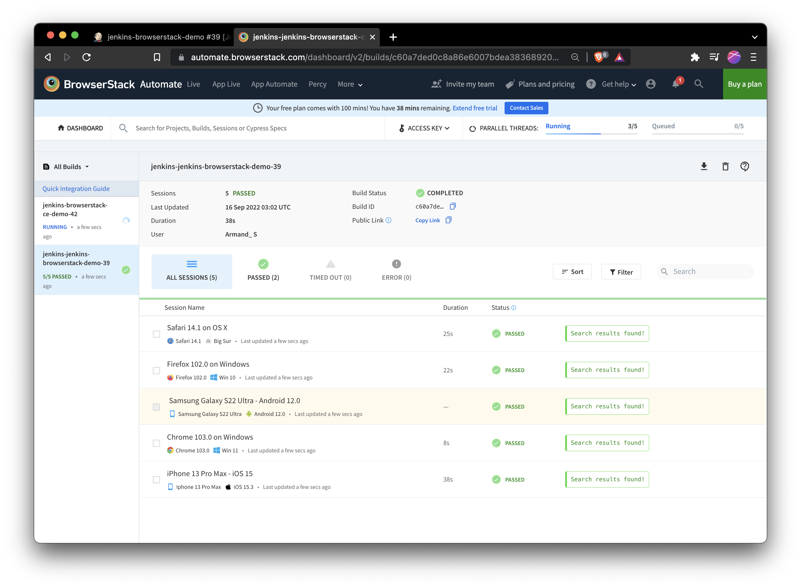
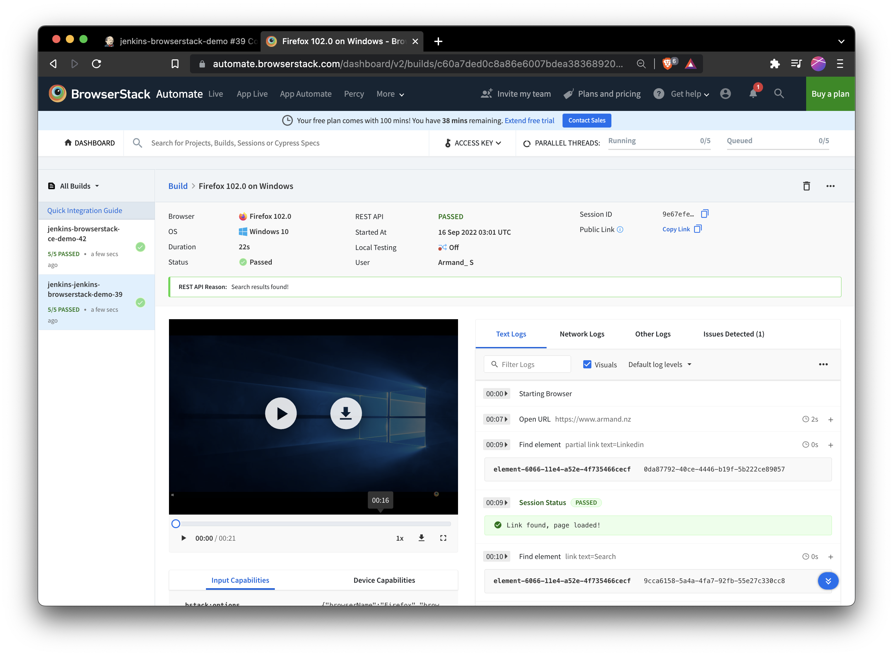
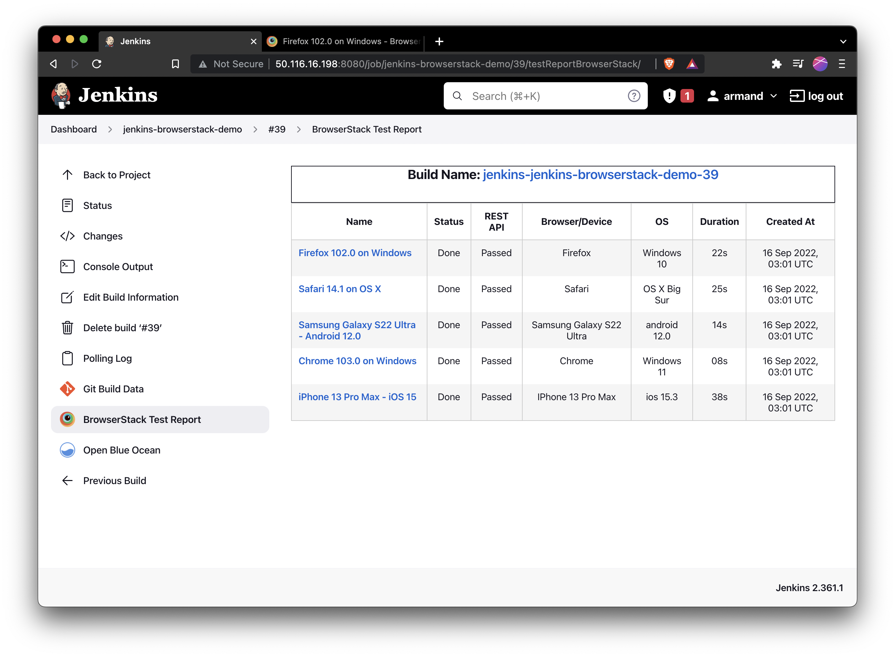
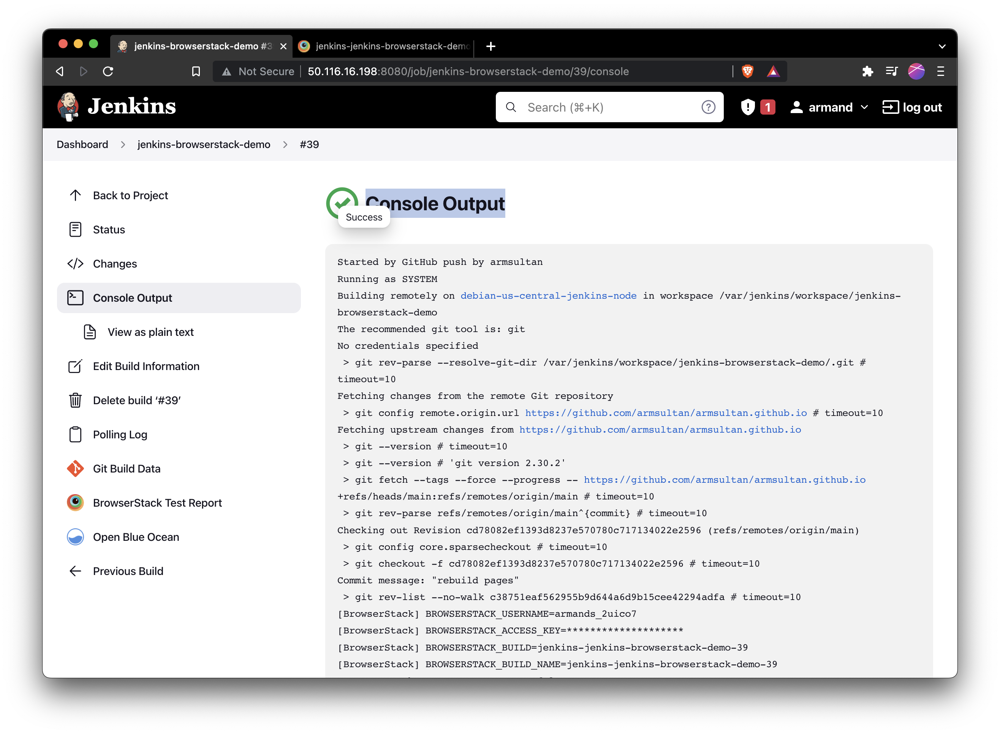

# BrowserStack demo

## About 

This is a short write-up on my experience integrating
[BrowserStack](https://www.browserstack.com/) and
[Jenkins](https://www.jenkins.io/).

## What is BrowserStack?

[BrowserStack](https://www.browserstack.com/) is a cross-browser testing
platform that lets developers integrate tools to perform automated, visual, and
live testing across mobile applications and websites. BrowserStack’s cloud
platform helps remove the complexity of testing against the thousands of
different devices, operating systems, and web browser engine combinations.

## Demo 

Build Trigger GitHub hook trigger for GITScm polling -> Jenkins pipeline -> Build -
Browserstack automate using Selenium WebDriver and ruby -> Post Action Build - BrowserStack Test Report

## Test Suite Setup Guide

The suite does the following:
 1.  Run on BrowserStack Automate (you will need to create a [free trial](https://www.browserstack.com/users/sign_up))
 2.  Contain 3 separate assertions
 3.  Run across 5 browsers in parallel

Inspect test artifacts:
 * [JenkinsFile](jenkinsfile) - Not used in Freestyle Project as seen in
   screenshots below, but can be used for Pipeline project
 * [`test.rb`](test.rb) - BrowserStack Automate written in Ruby

How to setup - *Todo*

## Screenshots and output










**Console output in Jenkins**

```
Started by GitHub push by armsultan
Running as SYSTEM
Building remotely on debian-us-central-jenkins-node in workspace /var/jenkins/workspace/jenkins-browserstack-demo
The recommended git tool is: git
No credentials specified
 > git rev-parse --resolve-git-dir /var/jenkins/workspace/jenkins-browserstack-demo/.git # timeout=10
Fetching changes from the remote Git repository
 > git config remote.origin.url https://github.com/armsultan/armsultan.github.io # timeout=10
Fetching upstream changes from https://github.com/armsultan/armsultan.github.io
 > git --version # timeout=10
 > git --version # 'git version 2.30.2'
 > git fetch --tags --force --progress -- https://github.com/armsultan/armsultan.github.io +refs/heads/main:refs/remotes/origin/main # timeout=10
 > git rev-parse refs/remotes/origin/main^{commit} # timeout=10
Checking out Revision cd78082ef1393d8237e570780c717134022e2596 (refs/remotes/origin/main)
 > git config core.sparsecheckout # timeout=10
 > git checkout -f cd78082ef1393d8237e570780c717134022e2596 # timeout=10
Commit message: "rebuild pages"
 > git rev-list --no-walk c38751eaf562955b9d644a6d9b15cee42294adfa # timeout=10
[BrowserStack] BROWSERSTACK_USERNAME=armands_2uico7
[BrowserStack] BROWSERSTACK_ACCESS_KEY=********************
[BrowserStack] BROWSERSTACK_BUILD=jenkins-jenkins-browserstack-demo-39
[BrowserStack] BROWSERSTACK_BUILD_NAME=jenkins-jenkins-browserstack-demo-39
[BrowserStack] BROWSERSTACK_LOCAL=false
[jenkins-browserstack-demo] $ /bin/sh -xe /tmp/jenkins12541701267443745179.sh
+ gem install --no-user-install selenium-webdriver -v 4.1.0
Successfully installed selenium-webdriver-4.1.0
Parsing documentation for selenium-webdriver-4.1.0
Done installing documentation for selenium-webdriver after 1 seconds
1 gem installed
+ ruby test.rb
[BrowserStack] Generating BrowserStack Test Report
[BrowserStack] BrowserStack Project identified as : AUTOMATE
[BrowserStack] No Proxy Selected for BrowserStack Plugin
[BrowserStack] BrowserStack Report Status: Success
Finished: SUCCESS
```


